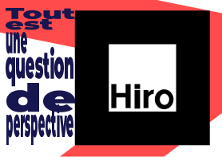

# Théo Dupuy

## Explication du projet : 

Mon slogan est le suivant "*Tout est une question de perpective*"
J'ai eu l'idée pour cela de créer une scène 3D en **anamorphose** où l'utilisateur peut se déplacer soit grâce à sa caméra soit avec les flèches de son clavier.

Lorsqu'il se déplace à droite, il a la possibilité d'observer différents logo qui correspondent aux outils que j'ai pu utiliser en MMI. Et si on se déplace sur la gauche on peut voir les lettres MMI se dessiner.

## Carte de visite : 

